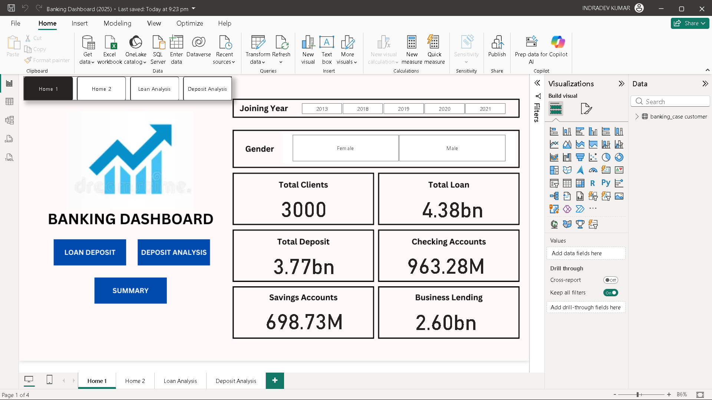
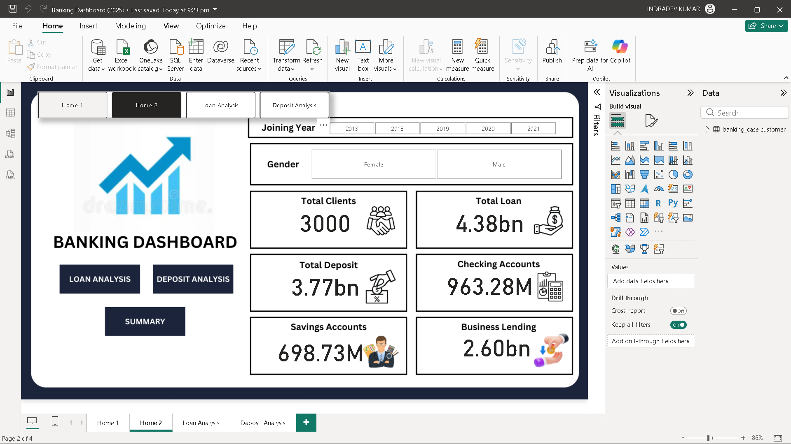
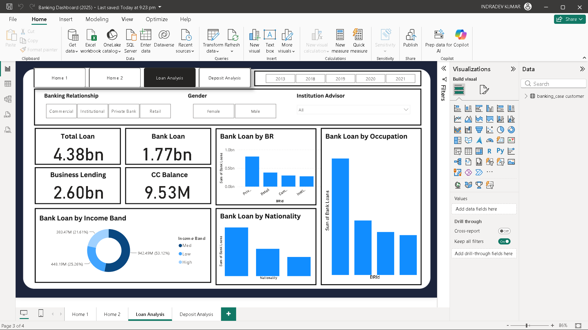
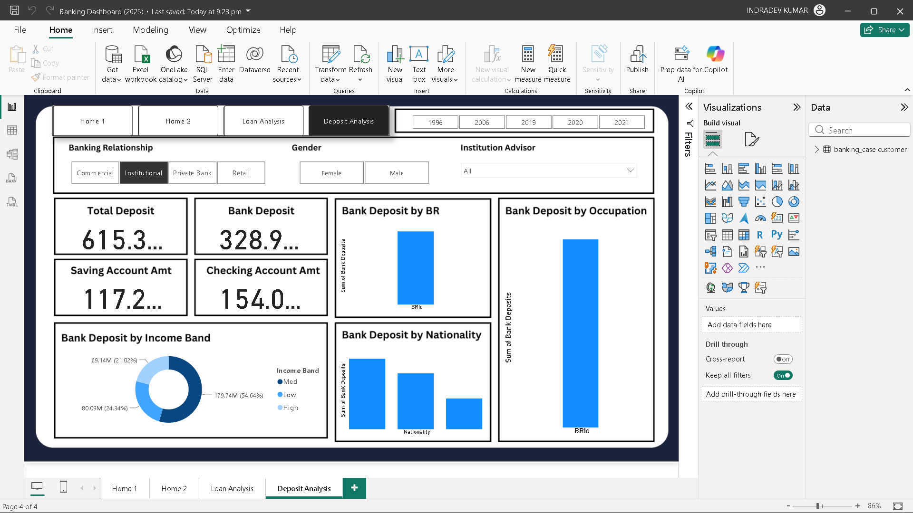

# 🏦 Banking Risk Analytics Dashboard

An end-to-end **Banking Risk Analytics** project built using **Python, SQL, and Power BI**. The project analyzes customer banking data to uncover insights into loans, deposits, customer engagement, and financial risk, helping banks make informed lending decisions.

## 📌 Problem Statement

Banks need to evaluate customer financial profiles before approving loans to minimize credit risk. This project provides interactive dashboards and analytics to support data-driven decision-making.

## 🚀 Tech Stack

- **Python** – Data Cleaning & Exploratory Data Analysis (EDA)
- **SQL** – Data Extraction & Transformation
- **Power BI** – Interactive Dashboard Development
- **DAX** – KPI Calculations & Measures

## 📂 Dataset

The dataset contains customer banking information across multiple related tables, including:

- Clients – Banking
- Banking Relationship
- Investment Advisor
- Gender
- Period

The tables are connected using **Primary** and **Foreign Keys**.

## 🛠️ Project Workflow

1. Cleaned and prepared data using **Python**.
2. Performed **Exploratory Data Analysis (EDA)** to identify trends and correlations.
3. Queried and transformed data using **SQL**.
4. Built a relational data model in **Power BI**.
5. Created DAX measures and interactive dashboards.

## 📊 Dashboard Pages

- 🏠 Home
- 📈 Summary Dashboard
- 💳 Loan Analysis
- 💰 Deposit Analysis

## 📌 Key KPIs

- Total Clients
- Total Loan
- Total Deposit
- Bank Loan
- Business Lending
- Bank Deposits
- Savings Accounts
- Checking Accounts
- Credit Card Balance
- Total Fees

## 📈 Key Insights

- Analyzed customer loan and deposit behavior.
- Compared banking relationships across customer segments.
- Identified high-value customers using income segmentation.
- Enabled interactive filtering by year, gender, and institution advisor.
- Supported better lending decisions through business intelligence.

## 📷 Dashboard Preview

| Home1 | Home2 |
|------|---------|
|  |  |

| Loan Analysis | Deposit Analysis |
|---------------|------------------|
|  |  |

## 🎯 Skills Demonstrated

**Python • SQL • Power BI • DAX • Data Cleaning • EDA • Data Modeling • Business Intelligence • Dashboard Development**

---
## 👨‍💻 Author
**Indradev Kumar**
